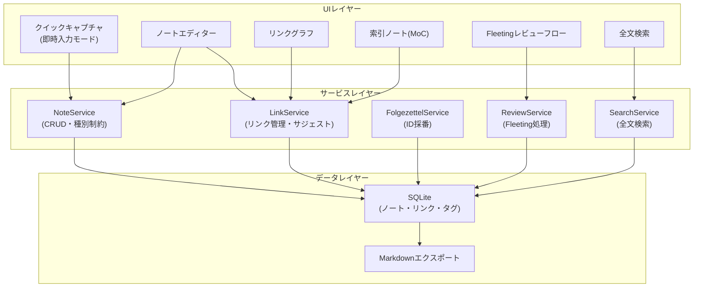
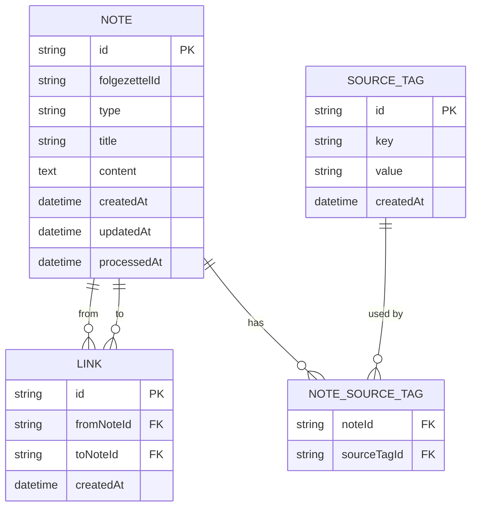
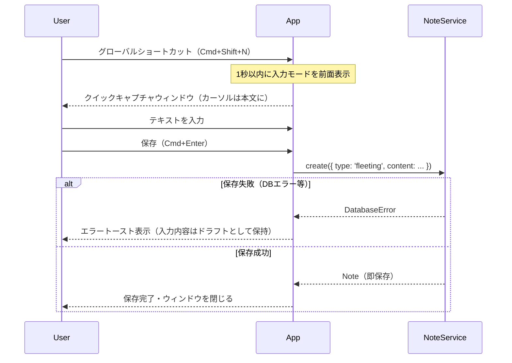
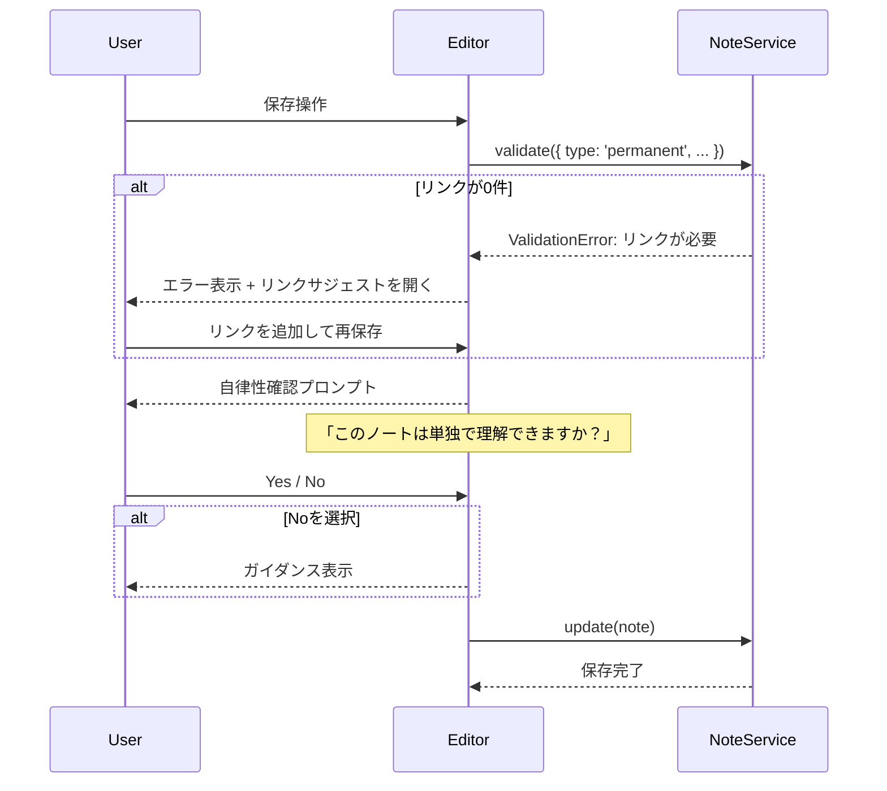
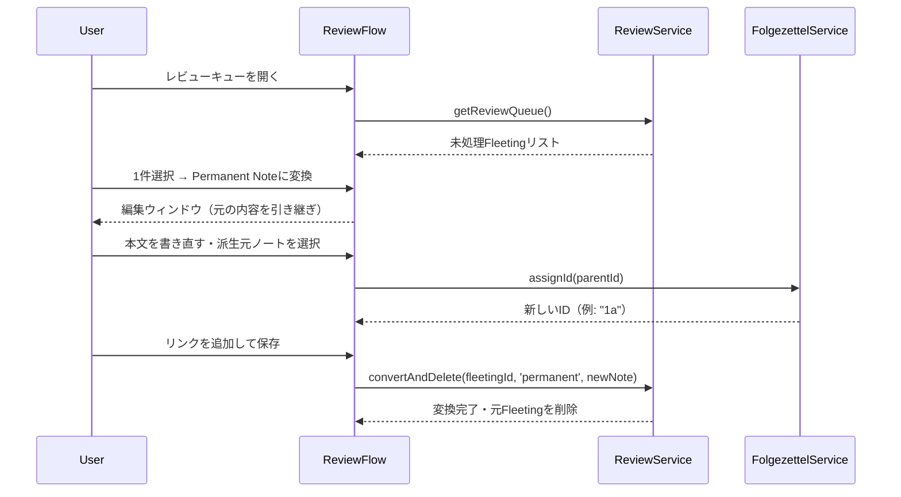
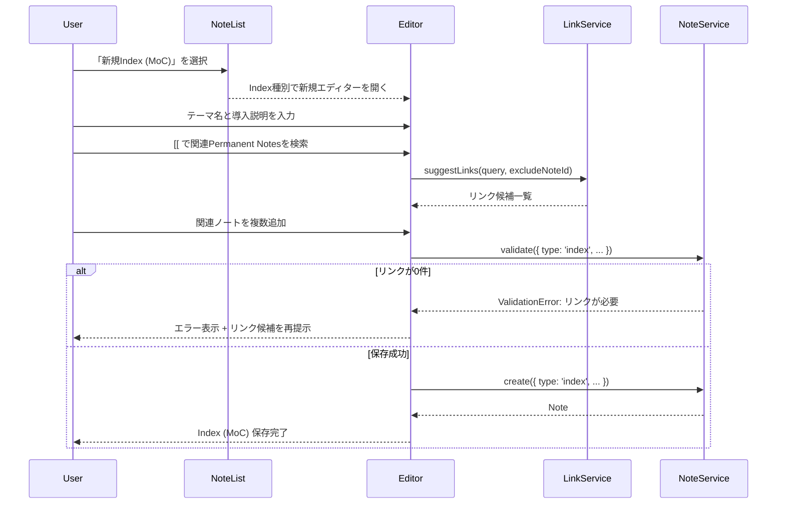
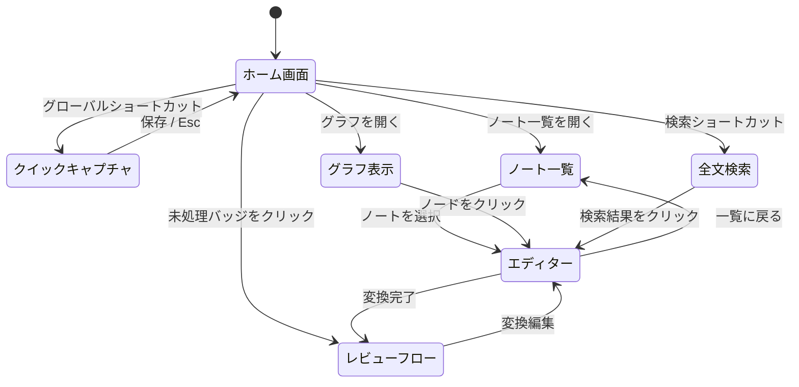

# 機能設計書 (Functional Design Document)

## システム構成図



## 技術スタック

| 分類 | 技術 | 選定理由 |
|---|---|---|
| 言語 | TypeScript | 型安全性・プロジェクトの標準スタック |
| ランタイム | Node.js v24 | プロジェクトの標準環境 |
| デスクトップUI | Electron | クロスプラットフォーム・グローバルショートカット対応 |
| UIフレームワーク | React | コンポーネント設計・状態管理 |
| データベース | SQLite (better-sqlite3) | ローカルファイル・リンク管理・ID管理に適合 |
| テキストエディター | CodeMirror 6 | Markdownサポート・リンクサジェスト拡張 |
| グラフ可視化 | D3.js | 柔軟なノード/エッジ描画 |
| スマホ対応 | PWA (P1 / 後続フェーズ) | Fleeting Note専用の軽量UI |

---

## データモデル定義

### エンティティ: Note（ノート）

```typescript
type NoteType = 'fleeting' | 'literature' | 'permanent' | 'index';

interface Note {
  id: string;               // UUID（全種別共通の内部ID）
  folgezettelId: string | null; // Luhmann式ID（例: "1a1"）。Fleeting / Literature では null。Permanent Note は保存時に採番済み、昇格処理中のみ一時的に null を許容
  type: NoteType;           // ノート種別
  title: string;            // タイトル（Fleeting Noteは自動生成可）
  content: string;          // 本文（Markdown）
  sourceTagIds: string[];   // 出典タグID（Literature Noteは必須）
  createdAt: Date;
  updatedAt: Date;
  processedAt: Date | null; // Fleeting Noteが処理された日時（変換・削除）
}
```

**制約**:
- `type === 'literature'` の場合: `sourceTagIds.length >= 1`
- `type === 'permanent'` の場合: リンクテーブルで参照される他ノートへの接続が1件以上
- `type === 'permanent'` の場合: 永続化前に `folgezettelId` を採番し、保存済みノートでは non-null とする
- `type === 'fleeting'` の場合: 全フィールドが任意（即保存）
- `type === 'index'` の場合: Permanent Notesへのリンク集として機能。制約は `permanent` と同様
- `type === 'index'` の場合: `permanent` と同様に `folgezettelId` を採番する（テーマ別の知識地図として知識ネットワーク上の位置を持つため）

---

### エンティティ: Link（リンク）

```typescript
interface Link {
  id: string;
  fromNoteId: string; // リンク元ノートID
  toNoteId: string;   // リンク先ノートID
  createdAt: Date;
}
```

**制約**:
- `fromNoteId !== toNoteId`（自己参照不可）
- 同一ペアの重複リンク不可（UNIQUE制約）
- 双方向参照: バックリンクは逆方向クエリで自動参照可能

---

### エンティティ: SourceTag（出典タグ）

```typescript
interface SourceTag {
  id: string;
  key: string;   // タグのキー（例: "author", "title", "url"）
  value: string; // タグの値（例: "Ahrens", "How to Take Smart Notes"）
  createdAt: Date;
}
```

**例**:
```
@author:Ahrens
@title:How to Take Smart Notes
@url:https://example.com
@page:42
```

---

### ER図



---

## コンポーネント設計

### NoteService（ノート管理）

**責務**: ノートのCRUD・種別バリデーション・昇格処理

```typescript
class NoteService {
  create(input: CreateNoteInput): Note;
  update(id: string, input: UpdateNoteInput): Note;
  delete(id: string): void;
  validate(note: Partial<Note>, links: Link[]): ValidationResult;
  promote(fleetingId: string, targetType: 'permanent' | 'literature', input: PromoteInput): Note;
  getById(id: string): Note | null;
  getByType(type: NoteType): Note[];
  getUnprocessedFleeting(): Note[];
  getStaleFleeting(daysThreshold: number): Note[];
}

interface PromoteInput {
  content?: string; // 書き直し後の本文。省略時は元のFleeting Note本文を引き継ぐ
  parentFolgezettelId?: string | null; // Permanent Noteへの昇格時のみ使用
  sourceTagIds?: string[]; // Literature Noteへの昇格時のみ使用
}

interface ValidationResult {
  valid: boolean;
  errors: ValidationError[];
}

interface ValidationError {
  field: string;
  message: string;
  suggestion: string; // ユーザーへの解決策の提示
}
```

> `NoteService.getById()` はノートが存在しない場合に `null` を返す。IPC API の `note:getById` も同じ契約に揃える。

> **エラークラス定義**: `AppError`, `ValidationError`, `NoteNotFoundError` 等の実装は [docs/development-guidelines.md](development-guidelines.md#エラーハンドリング) を参照してください。

---

### LinkService（リンク管理）

**責務**: リンクCRUD・候補サジェスト・双方向バックリンク参照

```typescript
class LinkService {
  addLink(fromNoteId: string, toNoteId: string): Link;
  removeLink(id: string): void;
  getLinks(noteId: string): { outgoing: Link[]; incoming: Link[] };
  getLinkCount(noteId: string): number;
  suggestLinks(query: string, excludeNoteId: string): Note[];
  getIsolatedNotes(): Note[]; // リンクが0件のPermanent Note
}
```

---

### FolgezettelService（ID採番）

**責務**: Luhmann式IDの採番・派生ツリー管理

```typescript
class FolgezettelService {
  assignId(parentFolgezettelId: string | null, existingSiblingIds: string[]): string;
  // 例:
  //   parent = null  → "1", "2", "3" ...
  //   parent = "1"   → "1a", "1b" ...
  //   parent = "1a"  → "1a1", "1a2" ...

  getChildren(folgezettelId: string): Note[];
  getParent(folgezettelId: string): Note | null;
}
```

**採番アルゴリズム**:
- 数字で終わる親ID（例: `1`, `1a1`） → アルファベットを付与（`1a`, `1a1a`）
- アルファベットで終わる親ID（例: `1a`） → 数字を付与（`1a1`, `1a2`）
- 同一親の既存子IDを確認して次の文字/数字を決定

**エッジケースの処理**:

| 状況 | 処理方法 |
|------|---------|
| アルファベットが `z` に達した | `OverflowError` をスロー。ユーザーに手動再配置を促す |
| 数字が `9` に達した | `OverflowError` をスロー |
| 既存IDとの衝突 | 自動的にスキップして次の文字/数字を採番 |

---

### ReviewService（Fleetingレビューフロー）

```typescript
class ReviewService {
  getReviewQueue(): Note[];
  getStaleNotes(days: number): Note[];
  convertAndDelete(
    fleetingId: string,
    targetType: 'permanent' | 'literature',
    newNoteInput: CreateNoteInput
  ): Note;
  deleteAsFleeting(id: string): void;
}
```

---

### SearchService（全文検索）

**実装**: SQLite FTS5仮想テーブル（`notes_fts`）を使用して高速全文検索を実現する。

```typescript
class SearchService {
  search(query: string, options?: SearchOptions): SearchResult[];
}

interface SearchOptions {
  types?: NoteType[];
  sourceTagKey?: string;
  folgezettelId?: string;
}

interface SearchResult {
  note: Note;
  matchedField: 'title' | 'content' | 'tag' | 'id';
  snippet: string;
}
```

> **PWA設計の扱い**: スマホ向けPWAの詳細設計はMVPコア完了後の後続フェーズで別途ステアリングファイルに切り出して定義する。本ドキュメントではデスクトップ中心のMVPコアと、それに接続するP1要求のみを扱う。

---

## ユースケースフロー

### UC-1: 即時メモ入力（クイックキャプチャ）



---

### UC-2: Permanent Noteの保存



---

### UC-3: Fleeting → Permanent 変換



---

### UC-4: Index (MoC) の作成



---

## 画面遷移図



---

## UIコンポーネント設計

### クイックキャプチャウィンドウ

- Electron サブウィンドウとして常に最前面表示
- 起動から入力開始まで1秒以内（本文にオートフォーカス）
- `Cmd+Enter` で保存・閉じる / `Esc` で破棄・閉じる
- ウィンドウサイズ: 400 × 200px

### ノート種別カラーコード

| 種別 | 色 | 意味 |
|---|---|---|
| Fleeting | 黄色 | 一時的・要処理 |
| Literature | 青 | 外部参照元 |
| Permanent | 緑 | 恒久・知識ネットワークの構成要素 |
| Index (MoC) | 紫 | 地図・入り口 |

### バリデーションエラー表示仕様

```
❌ Permanent Noteにはリンクが最低1つ必要です
💡 [[ を入力してリンク候補から選ぶか、既存ノートへのリンクを追加してください
```

---

## データ永続化

### SQLiteスキーマ

```sql
CREATE TABLE notes (
  id TEXT PRIMARY KEY,
  folgezettel_id TEXT UNIQUE,
  type TEXT NOT NULL CHECK(type IN ('fleeting','literature','permanent','index')),
  title TEXT,
  content TEXT,
  created_at DATETIME NOT NULL,
  updated_at DATETIME NOT NULL,
  processed_at DATETIME
);

CREATE TABLE links (
  id TEXT PRIMARY KEY,
  from_note_id TEXT NOT NULL REFERENCES notes(id) ON DELETE CASCADE,
  to_note_id TEXT NOT NULL REFERENCES notes(id) ON DELETE CASCADE,
  created_at DATETIME NOT NULL,
  UNIQUE(from_note_id, to_note_id)
);

CREATE TABLE source_tags (
  id TEXT PRIMARY KEY,
  key TEXT NOT NULL,
  value TEXT NOT NULL,
  created_at DATETIME NOT NULL
);

CREATE TABLE note_source_tags (
  note_id TEXT NOT NULL REFERENCES notes(id) ON DELETE CASCADE,
  source_tag_id TEXT NOT NULL REFERENCES source_tags(id) ON DELETE CASCADE,
  PRIMARY KEY (note_id, source_tag_id)
);

-- 全文検索用FTS5
CREATE VIRTUAL TABLE notes_fts USING fts5(
  title,
  content,
  content=notes,
  content_rowid=rowid
);
```

### 自動保存（下書き）

- 編集中は30秒ごとに localStorage にドラフト保存
- アプリ起動時に未保存ドラフトがあれば復元を提案
- DB保存完了後にドラフトを削除

#### ドラフトの容量管理ポリシー

- localStorageの容量上限（一般的に5〜10MB）を考慮し、DB保存済みノートのドラフトキー（`draft_{noteId}`）は即座に削除する
- 起動時に`draft_*`キーを全て走査し、DBに存在しないノートIDのドラフトは孤児データとして自動削除する

#### ドラフトのキー設計

```typescript
// localStorage key: draft_{noteId}
const draftKey = `draft_${noteId}`;
localStorage.setItem(draftKey, JSON.stringify({ noteId, content, updatedAt: new Date() }));
```

#### 復元フロー

- アプリ起動時に `draft_*` キーが存在すれば「未保存の編集があります。復元しますか？」プロンプトを表示
- Yes → エディターに復元、No → ドラフトを削除

---

> **エラーハンドリング設計・テスト戦略**は [docs/architecture.md](architecture.md) を参照してください。
